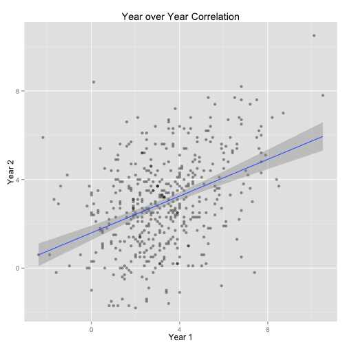

## Introduction

How can we predict a batter's offensive performance most accurately?  Which stats tend to be consistent from year to year, and which fluctuate with luck?  By looking at paired player seasons, we can see which stats have the most year to year correlation.  

First, we need to pull data.  [Fangraphs](www.Fangraphs.com) is a great resource for MLB statistics.  I took single seasons from 2009-2014.  Next we need to match these up by player, and align the season pairs.  

---
## Getting and Cleaning the data

First, we set up our libraries, read in the data, and do some renaming  

```r
library(ggplot2)
library(dplyr)
library(reshape2)
library(slidify)
options(digits = 3, scipen=999)

data <- read.csv("~/documents/erich/r/mlb0914.csv")

#Adjust names
labs <- names(data)
names(data) <- c(labs[1:9],"BBpct", "Kpct",labs[12:17], "wRCplus", labs[19:23])

#Adjust BB% and K% to numeric
data$BBpct <- gsub(" %", "", data$BBpct)
data$BBpct <- as.numeric(paste(data$BBpct))/100
data$Kpct <- gsub(" %", "", data$Kpct)
data$Kpct <- as.numeric(paste(data$Kpct))/100
```

---
## Arranging the data in pairs

Now, the tricky part, massaging the data in a way that allows for year over year pairs


```r
#Arrange data for Season vs Season comparions by player (also removing Team variable)
melt.data <- melt(data[,-3], id.vars=c("playerid","Name", "Season"))
seasons <- dcast(melt.data, playerid + Name + variable ~ Season)
str(seasons)

##Create two season pair data frame
names <- c("playerid", "Name", "variable", "x", "y")
season.pairs <- rbind(setNames(seasons[1:5], names),
                      setNames(seasons[c(1:3,5:6)], names),
                      setNames(seasons[c(1:3,6:7)], names),
                      setNames(seasons[c(1:3,7:8)], names),
                      setNames(seasons[c(1:3,8:9)], names))
season.pairs <- season.pairs[which(complete.cases(season.pairs) ==T),]  #Remove NAs

cortable <- summarize(group_by(season.pairs, variable), cor(x,y)) 
names(cortable) <- c("variable", "cor")
```

---
## Interpreting the data

We can see that context specific statistics (R, RBI) and batted ball statistics (AVG, BABIP) are less predictive, year over year, than Plate Discipline stats (OBP, K%, BB%) and Power stats (HR, ISO, SLG)


```r
library(pander)
pander(cortable, style="rmarkdown", width=50, height=50)
```


|  variable  |  cor   |
|:----------:|:------:|
|     G      | 0.2292 |
|     PA     | 0.3411 |
|     HR     | 0.7186 |
|     R      | 0.4958 |
|    RBI     | 0.6039 |
|     SB     | 0.8228 |
|   BBpct    | 0.7522 |
|    Kpct    | 0.885  |
|    ISO     | 0.7119 |
|   BABIP    | 0.4389 |
|    AVG     | 0.4661 |
|    OBP     | 0.5442 |
|    SLG     | 0.5697 |
|    wOBA    | 0.534  |
|  wRCplus   | 0.5261 |
|    BsR     | 0.6444 |
|    Off     | 0.4963 |
|    Def     | 0.6389 |
|    WAR     | 0.4045 |


---
## Examing WAR pairs

We can look at the season pairs for WAR (Wins Above Replacement) to examine their correlation.  

 
